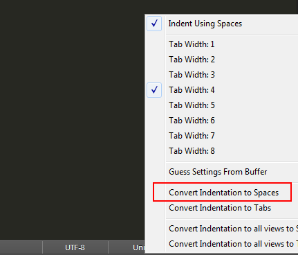

# TabToSpaceConverter

TabToSpaceConverter is a Sublime Text plugin that converts tab characters in a file
to spaces and applies your new tab width setting to it; while preserving tab based
inline alignments.

Batch converting is supported.

## Overview

* [The Problem](#the-problem)
* [The Solution](#the-solution)
* [Installation](#installation)
* [Usage](#usage)
* [Similar Plugins](#similar-plugins)
* [License](#license)

## The Problem

Let's say you have a file that uses hard tabs for indendation and for inline
alignment:


And the above file is created with `tab_size = 8` setting, so the inline alignment
only works when the `tab_size` is `8`.

And then you want to adapt the file to a different styleguide, which uses 4 spaces
for indentation. When you open the file with the new settings, you will see:


To apply the new styleguide to the file, you would normally use the Sublime Text
menu in the status bar (Convert Indentation to Spaces):



Which would give you the below result, breaking the inline alignment:


## The Solution

Use this plugin and get the below result, as you would expect:


## Installation

You can install the plugin via:

* Package Manager by searching `TabToSpaceConverter`
* `git clone https://github.com/maliayas/SublimeText_TabToSpaceConverter.git TabToSpaceConverter`
* Downloading the [zip][] of the repo and extracting into `Packages/TabToSpaceConverter`

The plugin is developed for Sublime Text 3 and above. It's not tested on Sublime
Text 2; however it may still work there, so you can give it a try if you have to.

## Usage

This plugin is meant to be used with a keybinding. It's not defined by default,
because it needs some configuration. You should click the `Preferences > Key Bindings`
menu and then add a keybinding like this:

```json
{
    "keys"      : ["ctrl+alt+t"],
    "command"   : "tab_to_space_converter",
    "args"      : {"previous_tab_size": 8, "all_views": false}
}
```

*   `previous_tab_size`: In order the plugin to preserve inline alignments, it has
    to know what `tab_size` setting was used when the file was created.

*   `all_views`: If you set this to `true`, __all the open views__ will be
    converted. To save all those files, you can use the `File > Save All` menu.

You don't have to provide your current `tab_size` setting to the plugin, just set it
in the Sublime Text and the plugin will read it.

## Similar Plugins

Other plugins that are similar to this one (they don't do the same task though):

*   [Normalize Indentation](https://packagecontrol.io/packages/Normalize%20Indentation) ([GitHub](https://github.com/Ennosuke/Normalize-Indentation))
*   [Indent Size](https://packagecontrol.io/packages/Indent%20Size) ([GitHub](https://github.com/socsieng/sublime-indent-size))

## License

TabToSpaceConverter is released under the [MIT License][mit].

[mit]:  http://www.opensource.org/licenses/MIT
[zip]:  https://github.com/maliayas/SublimeText_TabToSpaceConverter/archive/master.zip
